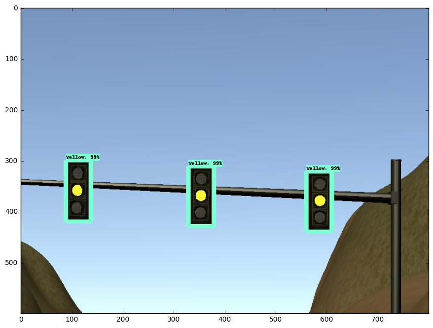
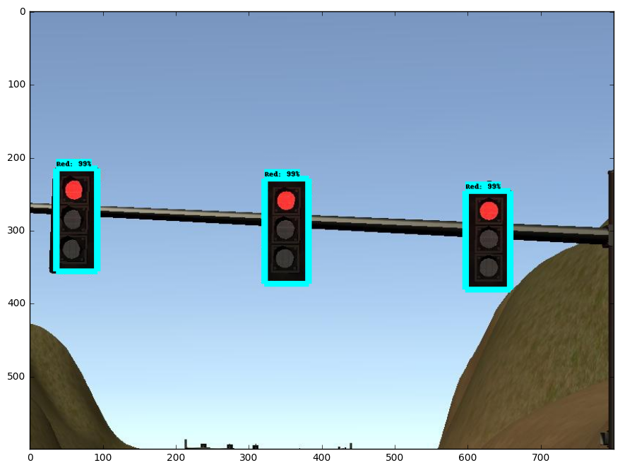

# Team SmartBlocks Capstone Project 

The video below demonstrates our project in action. The car stops at the red light and wait for it to turn green before crossing the intersection.

<p align=center>
	
</p>

## Team
---

| Name        |Email           | Linked-In  |
| ------------- |-------------| -----|
| Faisal Khan |    faisal.nust@gmail.com | https://www.linkedin.com/in/faisalkhan83/ |
| Rowen Wang      | wangjl_sdu@hotmail.com      |  https://www.linkedin.com/in/rowenw/ |
| Stephen Horton |stevehorton47@gmail.com     |     |
| Sundeep Tuteja | sundeeptuteja@gmail.com|https://www.linkedin.com/in/sundeep-t-2b26747/|
|Tiezheng Zhao |zhaotzheng@gmail.com|http://www.linkedin.com/in/tiezhengzhao|


## Goals
---

The project focused on integrating different components of a self driving car using [ROS](http://www.ros.org/) (Robot Operating System). In particular, we implemented a waypoint updater module, a traffic light detection modle, and a drive by wire module.  

## Waypoint Updater
---

The waypoint_updater node is responsible for providing desired waypoint information to the waypoint_follower node while considering the positions of red traffic lights, and, possibly, obstacles. This information incorporates both pose (position + orientation) and desired velocity information. The waypoint_updater node subscribes to the /current_pose and /base_waypoints topics, and publishes to topic final_waypoints.

The node sets one parameter called PREFERRED_STOPPING_DISTANCE, which allows the user to calibrate the distance from the stopline for a red light at which deceleration should start. The default value is 10.0 meters.

It sets another parameter called LOOKAHEAD_WPS, set to 200 by default. This parameter contains the maximum number of waypoints to be published to topic /final_waypoints.

If no red light is visible, this node will simply transmit a specified number of waypoints ahead of the vehicle itself. In order to achieve this, it first computes the index of the closest waypoint, and publishes the position and velocity information of the specified number of waypoints in front of this closest waypoint.

If a red light is encountered, the waypoint_updater node will gradually reduce the velocities using a linear function (although other functions are possible, and may be more representative of realistic driving conditions), such that the vehicle velocity at the stopline is 0.0 m/s. It also sets the velocities of several waypoints ahead to 0.0 m/s, to increase the chances of a full stop. The reduction in velocities take place at a specified distance away from the red light.


## Traffic Light Detection
---

One important part of the self-driving is to detect and classify upcoming traffic lights. The system processes images provided by car-mounted camera, figure out the information of the nearest traffic light,including location and color, and publish upcoming traffic light information to ```traffic_waypoint``` topic. 

The actual detection is done by passing the images through a convolution neural network that is trained using the labeled images of traffic light states from the simulator. The network was trained using the object detection API of the tensorflow. We used faster-RCNN as our based model pre-trained on COCO dataset.	

<p align=center>
	
</p>

<p align=center>
	
</p>

## Drive by wire
---
### Overview

Dbw\_node subscribes from three topic ```/vehicle/dbw_enabled```, ```/twist_cmd``` and ```/current_velocity```. ```/vehicle/dbw_enabled``` tells whether the car is controlled by dbw\_node or not. ```/twist_cmd``` tells proposed linear and yaw velocity by waypoints\_updater. ```/current_velocity``` tells the car's current linear and yaw velocity.
What dbw\_node is trying to do is to generate throttle, brake and steer command and publish them to the vehicle.

```throttle``` and ```brake``` are generated by PID controller, LowPass filter is used to smooth ```throttle``` and ```brake```, preventing jerks. Detail would be decribed at a separate parts about PID and LowPass filter.

```steer``` command is generated with the help of yaw_controller provided by udacity in start repo. 

As to code part, ```dbw_node.py``` was collecting data from subscribed topic and publishing ```throttle/brake/steer``` command to vehicle. ```twist_controller.py``` was the main file processing the controlling logic. ```pid.py```, ```lowpass.py``` and ```yaw_controller.py``` was provided by udacity for PID controller, LowPass filter and steer command. 

### PID Controller

Code in ```pid.py``` was not changed at all. Appropriate parameters was used to create PID controller. In our implementation, we use ```kp=0.7```, ```ki=0.0007``` and ```kd=0.1```. 

At the beginning, the parameters was chosen based on the following prior knowledge, 

1) kp controls current error, the car should fix current error in time, so a big value for kp should be reasonable. We want the throttle to be 1.0 if the current error is bigger than 2m/s. So values from 0.5~1.0 would be good.

2) ki controls cumulated errors, we want to fix the cumulated error but a reasonable long time would be ok, so a small value was chosen.

3) kd controls differential value of errors, with a reasonable big values would prevent jerks, but should not exceed kp because current error always plays the important role.

At the second phase, we tuned the parameters to make the car stop and move in time.     

### LowPass Filter

LowPass filter was used to smooth ```throttle``` and ```brake``` values. We managed to use 2/3 current value and 1/3 previous values by setting ```ts=0.2``` and ```tau=0.1```. The values works well with simulator.


## Final Result on Simulator
---
[](https://www.youtube.com/watch?v=6IbyqjLUKMM)

